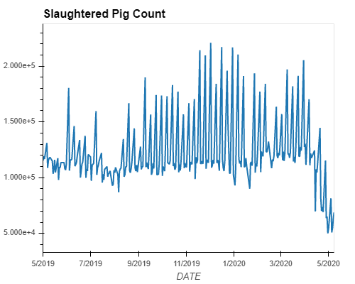
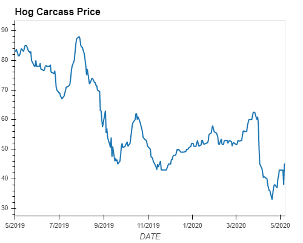
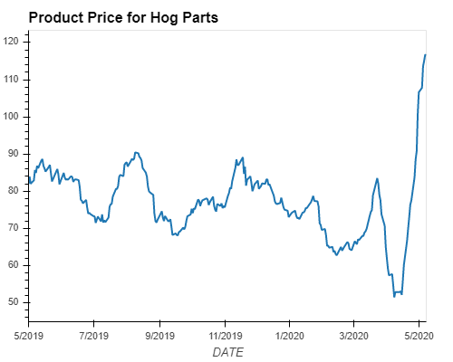
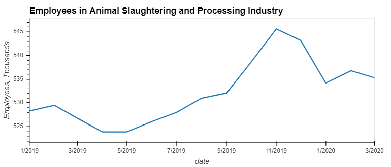
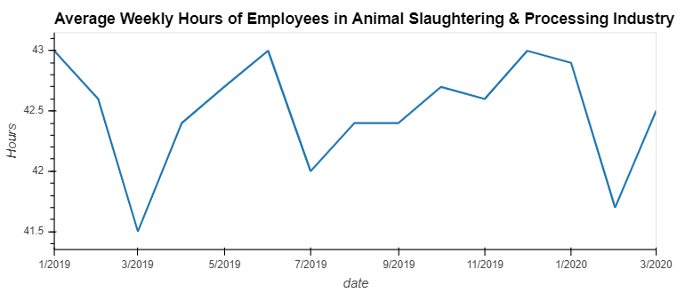
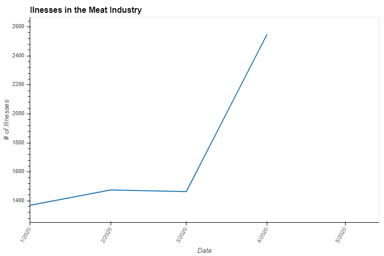

# Coronavirus vs Meat Industry
## An Analysis of How CoVid-19 affects the Meat Market
## Group 2 Project 1

## Description
This project will focus on how pork and beef is affected by the Coronavirus pandemic. Data will be gathered and analyzed to see how pricing of the products are affected.

Some other questions to consider with affects of beef and pork pricing:
- How coronavirus and pricing affects employment
- How pricing affects supply and demand
- The impact of coronavirus and pricing on profit and losses
- How food industry company stocks are affected

## Datasets (In Progress)
- USDA Beef and Pork Pricing
- US Bureau of Labor Statistics Employment Data
- Alpaca Trade Api
- Yahoo Finance

## Team Members
- Casey Burke (CB)
- Charles Xia (CX)
- Daniel Velderman (DV)
- Whelan Power (WP)

## Tasks
- Access, parse, analyze, plot data from USDA ARMS API data (CB & CX)
- Access, parse, analyze, plot data from US Bureau of Labor Statistics (DV & WP)
- Stocks Analysis (CX)
- General Covid-19 Information (CX)

---
# Final Presentation

## Headlines from the News

---
# Charts and Graphs

## Cost Variations for Pigs

Sources:
- https://www.reuters.com/article/usa-livestock/livestock-us-cattle-hog-futures-climb-as-wholesale-meat-prices-rise-idUSL1N2CJ1VY
- https://www.cnbc.com/2020/05/12/us-grocery-costs-jump-the-most-in-46-years-led-by-rising-prices-for-meat-and-eggs.html
- https://www.axios.com/coronavirus-pork-beef-prices-surge-meat-plants-52cdf848-3315-4077-90e5-90e1ccbddd39.html
- https://www.cnbc.com/2020/05/12/us-grocery-costs-jump-the-most-in-46-years-led-by-rising-prices-for-meat-and-eggs.html
- https://www.nytimes.com/2020/05/05/business/coronavirus-meat-shortages.html

## Employment Data

## Coronavirus and Illness Data

## Illnesses in Meat Packing Plants (Slaughtering and Meat Processing)

### Mapbox Map of Top 5 States of Empoloyment in Meat Packing Industry and Confirmed Coronavirus Infections by State
